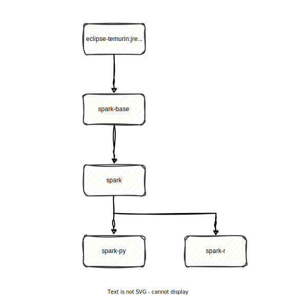

Collection of [Apache Spark](https://spark.apache.org/) docker images for [OKDP platform](https://okdp.io/).

Currently, the images are built from the [Apache Spark project distribution](https://archive.apache.org/dist/spark) and the requirement may evolve to produce them from the [source code](https://github.com/apache/spark).

The image relashionship is described by the following diagram:

 

| Image          | Description                                                                                                                                                                                                                                                                       |
|:---------------|-----------------------------------------------------------------------------------------------------------------------------------------------------------------------------------------------------------------------------------------------------------------------------------|
| `JRE`          | The JRE LTS base image supported by Apache Spark depending on the version. This includes Java 11/17/21. Please, check the [reference versions](.build/reference-versions.yml) or [Apache Spark website](https://spark.apache.org/docs/latest/) for more information. |
| `spark-base`   | The Apache Spark base image with official spark binaries (scala/java) and without OKDP extensions.                                                                                                                                                                                |
| `spark`        | The Apache Spark image with official spark binaries (scala/java) and OKDP extensions.                                                                                                                                                                                             | 
| `spark-py`     | The Apache Spark image with official spark binaries (scala/java), OKDP extensions and python support.                                                                                                                                                                             | 
| `spark-r`      | The Apache Spark image with official spark binaries (scala/java), OKDP extensions and R support.                                                                                                                                                                                  | 

# Tagging

The project builds the images with a long format tags. Each tag combines multiple compatible versions combinations.

There are multiple tags levels and the format to use is depending on your convenience in term of stability and reproducibility.

The images are pushed to [OKDP quay.io](https://quay.io/organization/okdp) repository with the following [tags](.build/images.yml):

| Images              | Tags                                                                                                                                                                                                                                                                                                                                                                                                                                                                              |
|:--------------------|-----------------------------------------------------------------------------------------------------------------------------------------------------------------------------------------------------------------------------------------------------------------------------------------------------------------------------------------------------------------------------------------------------------------------------------------------------------------------------------|
| `spark-base, spark` | spark-${spark_version}-scala-${scala_version}-java-${java_version} spark-${spark_version}-scala-${scala_version}-java-${java_version}-$(date '+%Y-%m-%d') spark-${spark_version}-scala-${scala_version}-java-${java_version}-${git_release_version} spark-${spark_version}-scala-${scala_version}-java-${java_version}-$(date '+%Y-%m-%d')-${git_release_version}                                                                                                     |
| `spark-py`          | spark-${spark_version}-python-${python_version}-scala-${scala_version}-java-${java_version} spark-${spark_version}-python-${python_version}-scala-${scala_version}-java-${java_version}-$(date '+%Y-%m-%d') spark-${spark_version}-python-${python_version}-scala-${scala_version}-java-${java_version}-${git_release_version} spark-${spark_version}-python-${python_version}-scala-${scala_version}-java-${java_version}-$(date '+%Y-%m-%d')-${git_release_version} |
| `spark-r`           | spark-${spark_version}-r-${r_version}-scala-${scala_version}-java-${java_version}  spark-${spark_version}-r-${r_version}-scala-${scala_version}-java-${java_version}-$(date '+%Y-%m-%d') spark-${spark_version}-r-${r_version}-scala-${scala_version}-java-${java_version}-${git_release_version} spark-${spark_version}-r-${r_version}-scala-${scala_version}-java-${java_version}-$(date '+%Y-%m-%d')-${git_release_version}                                        |

> [!NOTE]
> `git_release_version` corresponds the Github release version or git tag without the leading `v'.
>  Ex.: 1.0.0
>

# Alternatives

- [Official images](https://github.com/apache/spark-docker)

